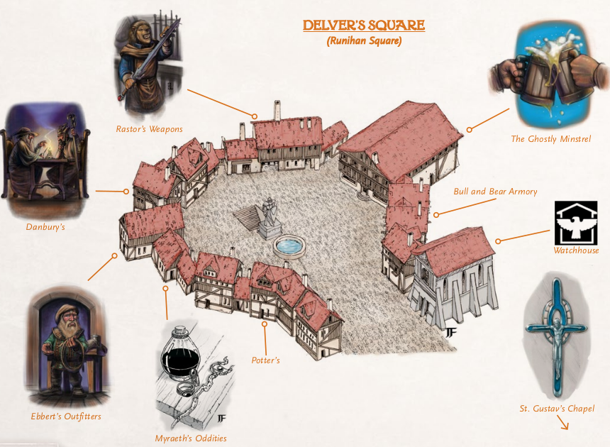
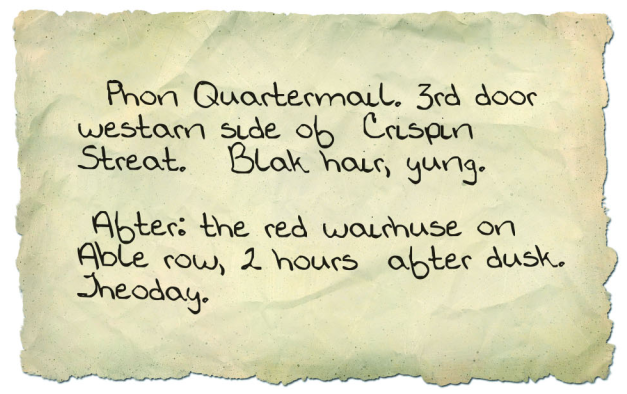

Delver's Square
===============

Our story begins in the middle of everything: Delver's Square. The
reasons drawing people are myriad, but all adventurers eventually find
themselves needing to visit this commercial hub of the city. Martigan
had a sword to sell, while Hudson and Kein were seeking work for their
own reasons.

After a successful sale at Rastor's Weapons, Martigan went over to The
Ghostly Minstrel to quench their thirst. Hudson was there already
looking for work, and they sat down together to discuss
possibilities.

As the gentle music of Tarin Ursalatao wafts across the bar, Kein
works to make themselves as small as possible, hoping not to be
noticed by Hudson, whom he mistakenly wronged a few years ago. Hudson
may not remember what happened, but they're nothing if not perceptive,
and quickly notice Kein's strange behavior.

Ale is a great lubricant, though, and what could have been a sticky
situation quickly evolves into good times. With their pockets feeling
a bit lighter, though, the need for work starts to feel more urgent
and they depart the tavern to meet Martigan's friend Brother Fabitor
at St. Gustav’s Chapel.

A Cry For Help
==============

As they cross the square heading for the chapel, rain begins to
fall. Not a heavy rain mind you, that light drizzle that gets
everything wet but doesn't feel strong enough to justify seeking
shelter. Before they reach the chapel, though, a cry for help rings
out and they leap into action.

Not yet able to see the source, our heroes sprint down Tavern
Row. Rounding the corner onto Able Row, the see a young woman with
long dark hair being chased by two thugish looking men. Even from a
distance, the black fingernails and double rings make it clear they're
from The Pale Dogs. What's also clear is that, without help, she
definitely won't get away.

Kein is the first to act, whipping out their bow and hitting Ortry
Gannon, the man in the lead, in the knee. As they reach for a second
arrow, though, they slip on the rain-slicked streets and fall to the
ground.

Martigan isn't far behind, though, tackling Derral Fank into Ortry and
knocking them both to the ground. Ortry then fires a crossbow from the
ground, but the shot goes wide.

While the combat is happening, Hudson quietly approaches the woman,
Phon Quartermain, and quickly persuades her to leave the scene. She's
reticent at first, but she discovers they're going to the Chapel she
readily agrees. Together they move down Able Row, away from the action
and towards safety.

Before Derral has a chance to rise, Martigan strikes a mighty blow,
knocking him unconscious. Seeing that he's outmatched, Ortry quickly
surrenders and they're both tied up.

Interrogation
=============

With the enemies subdued and Phon on her way to safety, Hudson returns
and together they grill Ortry and Darral for more information. They're
of course initially tight-lipped, but due to some extremely effective
questioning from Martigan they quickly spill the beans.

They've been hired by someone named Doffel, receiving a small amount
of gold now and more once upon completion of the job. They hand over a
small note explaining everything they know:

Fearing for the lives, these gang members hand over the 10 gold they
had received. Hudson nobly believes this should all be given to Phon
as compensation for her harrowing experience, but Kein disagrees. As
they hand the gold over, they attempt to palm a small amount, but
they're too clumsy and end up dropping it on the ground in the
process. Fortunately for the harmony of the group, this slight goes
unnoticed and all of the gold ends up going to Phon.
